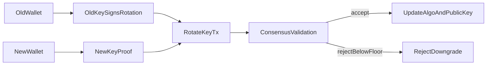

# Novelty In PQ-Agile Chain

## Core Claim

The novelty in this project is not "a blockchain that uses a post-quantum signature." That part is delegated to established post-quantum primitives from `pqcrypto`.

The novelty is that **post-quantum key migration is elevated into a consensus rule**.

## What Makes It Different

Many toy chains do one of these things:

- hardcode a single signature scheme forever
- identify an account directly with a public key
- treat key replacement as a wallet-side operation

`PQ-Agile Chain` instead gives each account a stable `account_id` and makes the following state explicit on-chain:

- `algo_id`
- `public_key`
- `security_floor`
- `nonce`
- `balance`

That creates room for controlled cryptographic evolution without changing account identity.

## Rotation Rule

`RotateKeyTx` is valid only if all of the following hold:

- the old on-chain key signs the rotation intent
- the new key signs a separate ownership proof
- the new algorithm's security level is at least the current `security_floor`
- the new `security_floor` is not lower than the current one
- the active key material actually changes

The important result is that "rotate to a better PQ algorithm later" is not just documentation. It is executable consensus logic.

## Security Floor

`security_floor` is the account's lower bound for future cryptographic migrations.

Example:

- Alice starts on `ml-dsa-65` with `security_floor = 3`
- Alice rotates to `sphincs-shake-256s-simple` and raises `security_floor = 5`
- From that point on, attempts to rotate Alice back to `ml-dsa-65` are rejected by the chain

This turns cryptographic agility into a one-way policy ratchet when the account owner wants it.

## Why Account ID Matters

If an address is just `hash(public_key)`, then key rotation changes identity semantics and can make migration awkward.

By separating `account_id` from `public_key`, this project allows:

- the same account identity to survive a key change
- the chain to reject stale keys after rotation
- balances and nonces to remain continuous across algorithm changes

## Flow

## Why This Still Stays Simple

The chain remains intentionally small:

- file-based local state
- replay validation
- toy proof-of-work
- only two signature backends

That simplicity is deliberate. It keeps the novelty inspectable and runnable instead of burying it under networking or smart-contract complexity.

## Threat Model Notes

This project demonstrates consensus behavior around PQ key management. It does not claim to solve:

- secure secret key storage
- network adversaries in a distributed setting
- denial-of-service resistance
- production-grade node synchronization
- economic security of mining

Its value is in showing that post-quantum cryptographic migration can be treated as **first-class ledger state**, not just as an upgrade note for operators.
