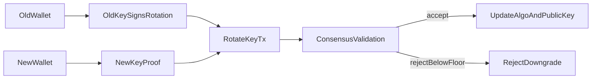

# On-Chain Key Rotation Model

## Scope

This note describes the part of the repository that is specific to post-quantum key migration.

Signature generation and verification are delegated to `pqcrypto`. The repository-specific logic is in how account identity, active key material, and downgrade prevention are represented in chain state.

## Stable Account Identity

The chain does not identify an account by `hash(public_key)`. Instead it keeps a stable `account_id` and stores the active:

- `algo_id`
- `public_key`
- `security_floor`
- `nonce`
- `balance`

This allows a key change to preserve the account's balance and nonce history.

## Rotation Transaction Semantics

`RotateKeyTx` contains:

- `account_id`
- `nonce`
- `old_algo_id`
- `old_public_key`
- `new_algo_id`
- `new_public_key`
- `requested_security_floor`
- `created_at`
- `old_signature`
- `new_key_proof`

The chain verifies two domain-separated payloads:

- `pq_agile_chain.rotate.old.v1`
- `pq_agile_chain.rotate.new.v1`

The old-key signature proves that the current on-chain key authorizes the transition. The new-key signature proves possession of the replacement key before the chain accepts it.

## What Changes And What Does Not

State preserved across a successful rotation:

- `account_id`
- balance
- nonce sequence

State updated by a successful rotation:

- `algo_id`
- `public_key`
- `security_floor` if the requested floor is raised

After the rotation block is mined, the previous key can still exist as a file on disk, but it is no longer a valid signing key for that account inside the chain state.

## `security_floor`

`security_floor` is a local policy rule used to reject configured downgrade paths.

Current backend mapping in this repository:

- `ml-dsa-65` -> `3`
- `falcon-512` -> `3`
- `ml-dsa-87` -> `5`
- `falcon-1024` -> `5`
- `sphincs-shake-256s-simple` -> `5`

Those values are defined in `src/pq_agile_chain/crypto_backends.py`. They are part of the repository's validation policy. They should not be read as a complete formal statement about algorithm strength outside this implementation.

Example:

- Alice starts on `ml-dsa-65` with `security_floor = 3`
- Alice can rotate laterally to another level-3 backend such as `falcon-512`
- Alice rotates to `sphincs-shake-256s-simple` and raises `security_floor = 5`
- a later attempt to rotate Alice back to `ml-dsa-65` or `falcon-512` is rejected

## Why This Model Exists

If identity were tied directly to the public key, a key change would either:

- change the account identity
- require an alias layer outside the ledger rules

Keeping `account_id` separate makes rotation a normal state transition that can be validated during replay.

## Flow

## Boundaries

This mechanism lives inside a compact local demonstrator:

- file-based state
- replay-based validation
- simple proof-of-work
- no peer-to-peer network

The point is not to model a production chain in full. The point is to make the key rotation rule explicit, inspectable, and executable.
