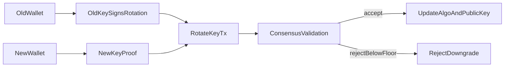

# Design Note: On-Chain Key Rotation

## Scope

This project does not propose a new post-quantum signature algorithm. Signature generation and verification are delegated to `pqcrypto`.

The design work here is in how the chain handles key changes.

## Main Idea

The chain does not identify an account by `hash(public_key)`. It keeps a stable `account_id` and stores the current:

- `algo_id`
- `public_key`
- `security_floor`
- `nonce`
- `balance`

That makes it possible to rotate keys without changing account identity.

## Rotation Rule

`RotateKeyTx` is accepted only if all of the following are true:

- the current on-chain key signs the rotation request
- the replacement key signs a possession proof
- the replacement algorithm meets the current `security_floor`
- the requested floor is not lower than the current floor
- the active key actually changes

Once the rotation is mined, the previous key is no longer valid for new transactions.

## Why `security_floor` Exists

`security_floor` is a lower bound for future key rotations.

Example:

- Alice starts on `ml-dsa-65` with `security_floor = 3`
- Alice rotates to `sphincs-shake-256s-simple` and raises `security_floor = 5`
- a later attempt to rotate Alice back to `ml-dsa-65` is rejected

This gives the account owner a monotonic upgrade policy if they want one.

## Why `account_id` Exists

If identity were tied directly to the public key, rotation would either:

- change the account identity
- require an address alias layer outside the core ledger rules

Keeping `account_id` separate allows:

- balance continuity across key changes
- nonce continuity across key changes
- rejection of stale keys after a successful rotation

## Flow

## Boundaries

This is still a compact local demo:

- file-based state
- replay-based validation
- simple proof-of-work
- no peer-to-peer network

It is intended to show that key migration policy can live inside ledger validation rather than only in wallet tooling or documentation.
